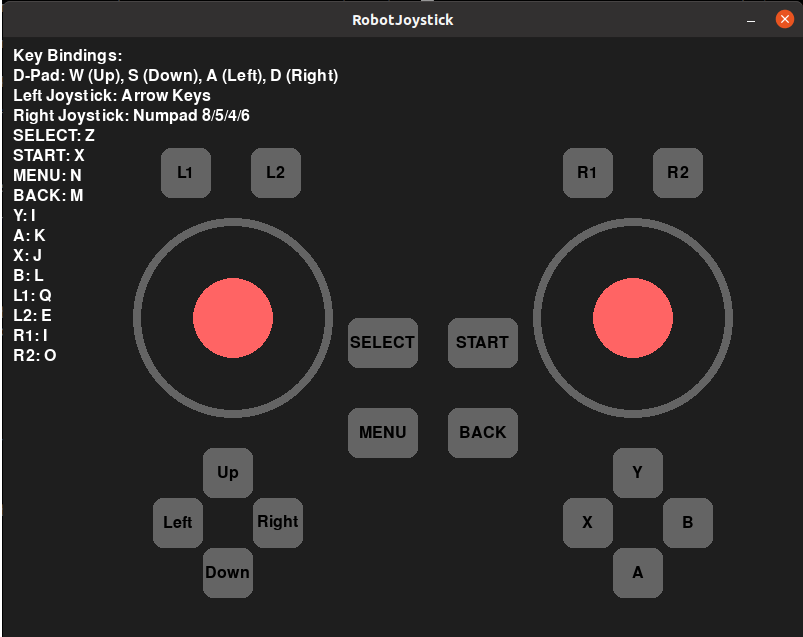
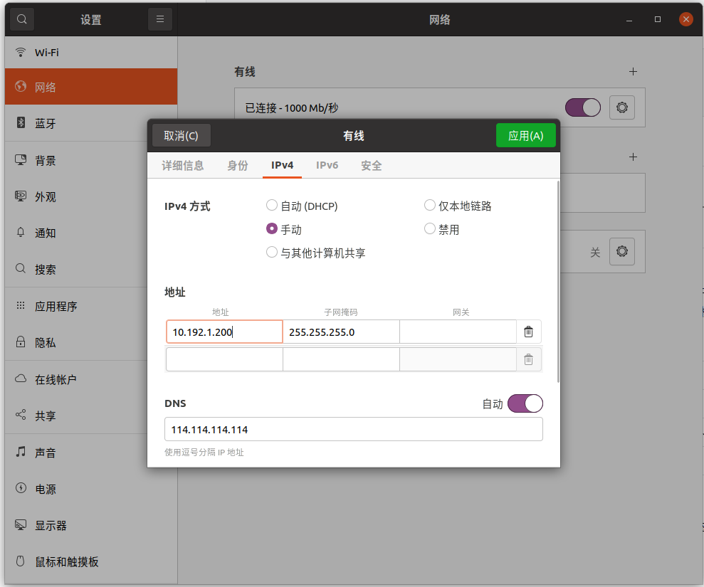

# 训练结果部署

### 1、概述

 若无需依赖 ROS 系统，仅用 C++ 开发，可参考本部署示例。示例无需依赖 ROS，专注纯 C++ 场景，涵盖环境配置、编译流程及基础功能实现。代码结构清晰，适配主流系统，便于复用或扩展，能降低开发门槛，助力高效完成项目搭建与迭代。

### 2、工程环境搭建

  推荐以操作系统Ubuntu 20.04 及以上版本为例，按照下面方法安装工程依赖：

- 安装编译环境

  ```
  sudo apt update
  sudo apt install cmake build-essential libeigen3-dev libyaml-cpp-dev python3 python3-pip -y
  sudo pip3 install vcstool colcon-common-extensions
  ```

- 安装onnxruntime依赖，下载链接：https://github.com/microsoft/onnxruntime/releases/tag/v1.10.0 。请您根据自己的操作系统和平台选择合适版本下载。如在Ubuntu 20.04 x86_64，请按下面步骤进行安装：

  ```
  wget https://github.com/microsoft/onnxruntime/releases/download/v1.10.0/onnxruntime-linux-x64-1.10.0.tgz
    
  tar xvf onnxruntime-linux-x64-1.10.0.tgz
  
  sudo cp -a onnxruntime-linux-x64-1.10.0/include/* /usr/include
  sudo cp -a onnxruntime-linux-x64-1.10.0/lib/* /usr/lib
  ```

### 3、创建工作空间

  可以按照以下步骤，创建一个RL部署开发工作空间：

- 打开一个Bash终端。

- 创建一个新目录来存放工作空间。例如，可以在用户的主目录下创建一个名为“limx_ws”的目录：
  ```Bash
  mkdir -p ~/limx_ws
  ```
  
- 下载 MuJoCo 仿真器
  ```Bash
  cd ~/limx_ws
  git clone --recurse git@github.com:limxdynamics/humanoid-mujoco-sim.git
  ```
  
- 下载运动控制算法：
  ```Bash
  cd ~/limx_ws
  
  # Option 1: HTTPS
  git clone --recurse https://github.com/limxdynamics/humanoid-rl-deploy-cpp.git
  
  # Option 2: SSH
  git clone --recurse git@github.com:limxdynamics/humanoid-rl-deploy-cpp.git
  ```
  
  
  
- 设置机器人型号：请参考“查看/设置机器人型号”章节，查看您的机器人型号。如果尚未设置，请按照以下步骤进行设置。
  - 通过 Shell 命令 `tree -L 1 humanoid-rl-deploy-cpp/robot_controllers/mimic_controller/config` 列出可用的机器人类型：
    
    ```
    cd ~/limx_ws/humanoid-rl-deploy-cpp/src
    tree -L 1 humanoid-rl-deploy-cpp/robot_controllers/mimic_controller/config
    humanoid-rl-deploy-cpp/robot_controllers/mimic_controller/config
    └── HU_D03_03
    
    ```
    
  - 以`HU_D03_03`（请根据实际机器人类型进行替换）为例，设置机器人型号类型：
    
    ```
    echo 'export ROBOT_TYPE=HU_D03_03' >> ~/.bashrc && source ~/.bashrc
    ```

### 4、仿真调试

- 运行MuJoco 仿真器（推荐Pyhon 3.8 及以上版本）

  - 打开一个 Bash 终端。

  - 安装运动控制开发库：
    - Linux x86_64 环境
    
      ```bash
      cd ~/limx_ws
      pip install humanoid-mujoco-sim/limxsdk-lowlevel/python3/amd64/limxsdk-*-py3-none-any.whl
      ```
    
    - Linux aarch64 环境
    
      ```bash
      cd ~/limx_ws
      pip install humanoid-mujoco-sim/limxsdk-lowlevel/python3/aarch64/limxsdk-*-py3-none-any.whl
      ```
    
  - 运行 MuJoCo 仿真器：
    
    ```bash
    cd ~/limx_ws
    python humanoid-mujoco-sim/simulator.py
    ```

- 运行算法

  - 打开一个 Bash 终端。

  - 编译并运行算法
    
    ```bash
    # 1、编译算法代码
    cd ~/limx_ws/humanoid-rl-deploy-cpp
    make
    
    # 2、运行算法
    cd ~/limx_ws/humanoid-rl-deploy-cpp
    source build/install/setup.bash
    robot_hw
    ```
    
    
  
- 虚拟遥控器：仿真的时候可以使用虚拟遥控器来操作机器人。以下是使用虚拟遥控器的具体步骤。

  - 打开一个 Bash 终端。

  - 运行虚拟遥控器

    ```
    ~/limx_ws/humanoid-mujoco-sim/robot-joystick/robot-joystick
    ```
    
    


  - 这时，您可以使用虚拟遥控器来控制机器人。
  
    | **按键** | **模式**         | **说明**                                                    |
    | -------- | ---------------- | ----------------------------------------------------------- |
    | L1+Y     | 切换到站立模式   | 如机器人没法站立，请点击MuJoco界面中的“Reset”进行复位一下。 |
    | L1+B     | 切换到打招呼模式 |                                                             |

### 5、真机调试

- 设置您电脑IP：确保您的电脑与机器人本体通过外置网口连接。设置您的电脑IP地址为：`10.192.1.200`，并通过Shell命令`ping 10.192.1.2` 能够正常ping通。如下图所示对您的开发电脑进行IP设置：

  

- 机器人准备工作：

  - 请通过机器人左右肩膀的挂钩把机器人吊起来。
  - 按电源键开机后，按下遥控器`右摇杆`按键，启动机器人电机。
  - 按下遥控器按键 `L1 + START`切换到开发者模式。在此模式下，用户可以开发自己的运动控制算法。（此模式设置后，下次开机继续生效，如需退出开发者模式请按`L1 + L2 + START`退出）。

- 实机部署运行。在Bash终端只需下面Shell命令启动控制算法（在进行实机部署运行时，确保机器人吊装非常重要）：

  ```bash
  # 1、编译算法代码
  cd ~/limx_ws/humanoid-rl-deploy-cpp
  make
  
  # 2、输入机器人IP地址（10.192.1.2）运行算法
  cd ~/limx_ws/humanoid-rl-deploy-cpp
  source build/install/setup.bash
  robot_hw 10.192.1.2
  ```
  
- 这时您可以通过遥控器按键`L1 + Y`让机器人进入站立模式。

- 遥控器按`L1 + B`控制机器人打招呼。
