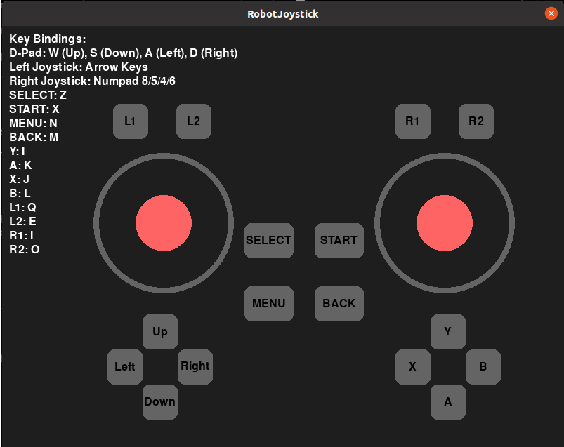
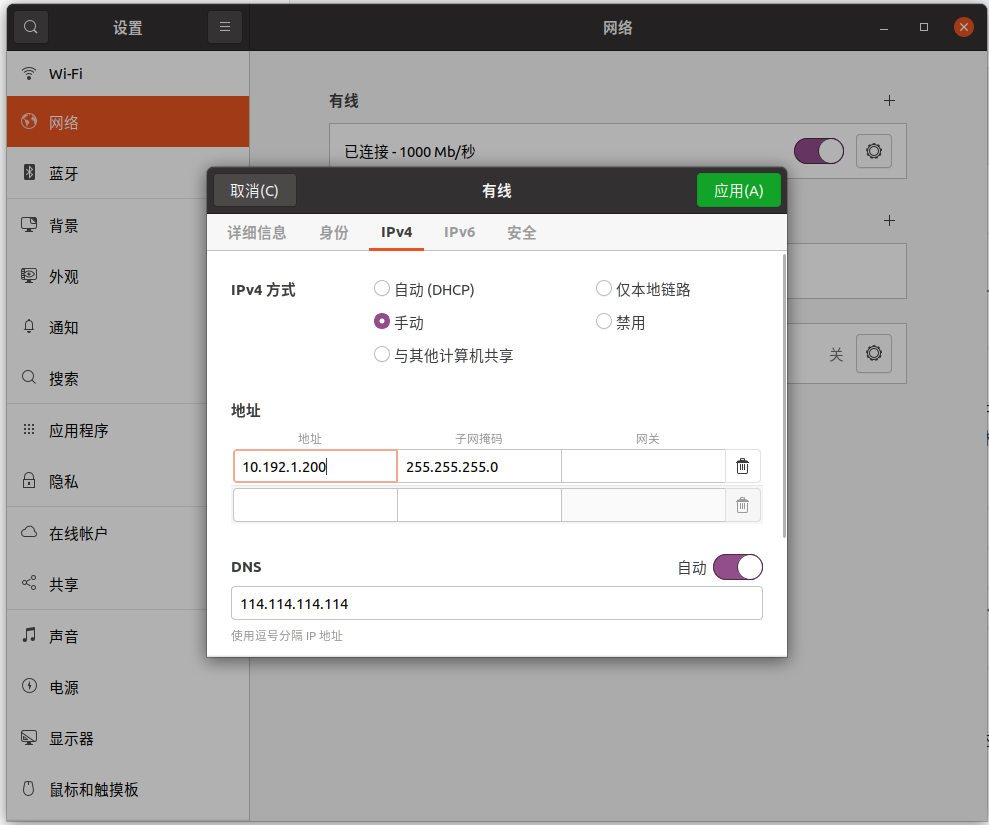

# English | [中文](README_cn.md)
# Deployment of Training Results

### 1. Overview

 If there's no need to rely on the ROS system and you prefer pure C++ development, you can refer to this deployment example. It focuses on pure C++ scenarios without ROS dependencies. It covers environment configuration, the compilation process, and basic function implementation. The code structure is clear, adaptable to mainstream systems, easy to reuse or extend. This can lower the development threshold and help efficiently complete project setup and iterations.

### 2. Engineering Environment Setup

  Take the Ubuntu 20.04 operating system and above as an example. Install project dependencies as follows:

- Install the compilation environment

  ```
  sudo apt update
  sudo apt install cmake build-essential libeigen3-dev libyaml-cpp-dev python3 python3-pip -y
  sudo pip3 install vcstool colcon-common-extensions
  ```

- Install the onnxruntime dependency. Download link: https://github.com/microsoft/onnxruntime/releases/tag/v1.10.0. Choose the appropriate version according to your OS and platform. For Ubuntu 20.04 x86_64, follow these steps:

  ```
  wget https://github.com/microsoft/onnxruntime/releases/download/v1.10.0/onnxruntime-linux-x64-1.10.0.tgz
    
  tar xvf onnxruntime-linux-x64-1.10.0.tgz
  
  sudo cp -a onnxruntime-linux-x64-1.10.0/include/* /usr/include
  sudo cp -a onnxruntime-linux-x64-1.10.0/lib/* /usr/lib
  ```

### 3. Create a Workspace

  Create an RL deployment and development workspace as follows:

- Open a Bash terminal.

- Create a new directory to store the workspace. For example, create a directory named "limx_ws" in the user's home directory:
  ```Bash
  mkdir -p ~/limx_ws
  ```
  
- Download the MuJoCo simulator
  ```Bash
  cd ~/limx_ws
  
  # Option 1: HTTPS
  git clone --recurse https://github.com/limxdynamics/humanoid-mujoco-sim.git
  
  # Option 2: SSH
  git clone --recurse git@github.com:limxdynamics/humanoid-mujoco-sim.git
  ```
  
- Download the motion control algorithm:
  ```Bash
  cd ~/limx_ws
  
  # Option 1: HTTPS
  git clone --recurse https://github.com/limxdynamics/humanoid-rl-deploy-cpp.git
  
  # Option 2: SSH
  git clone --recurse git@github.com:limxdynamics/humanoid-rl-deploy-cpp.git
  ```
  
  
  
- Set the robot model: If not set, follow these steps:
  - List available robot types via the Shell command tree -L 1 humanoid-rl-deploy-cpp/robot_controllers/mimic_controller/config:
    
    ```
    cd ~/limx_ws/humanoid-rl-deploy-cpp/src
    tree -L 1 humanoid-rl-deploy-cpp/robot_controllers/mimic_controller/config
    humanoid-rl-deploy-cpp/robot_controllers/mimic_controller/config
    ├── HU_D03_03
    └── HU_D04_01
    
    ```
    
  - Taking `HU_D04_01` (replace with your actual robot type) as an example, set the robot model type: 
    
    ```
    echo 'export ROBOT_TYPE=HU_D04_01' >> ~/.bashrc && source ~/.bashrc
    ```

### 4. Simulation Debugging

- Run the MuJoCo simulator (Python 3.8 or higher recommended)

  - Open a Bash terminal.

  - Install the motion control development library:
    - Linux x86_64 environment
    
      ```bash
      cd ~/limx_ws
      pip install humanoid-mujoco-sim/limxsdk-lowlevel/python3/amd64/limxsdk-*-py3-none-any.whl
      ```
    
    - Linux aarch64 environment
    
      ```bash
      cd ~/limx_ws
      pip install humanoid-mujoco-sim/limxsdk-lowlevel/python3/aarch64/limxsdk-*-py3-none-any.whl
      ```
    
  - Run the MuJoCo simulator:
    
    ```bash
    cd ~/limx_ws
    python humanoid-mujoco-sim/simulator.py
    ```

- Run the algorithm

  - Open a Bash terminal.

  - Compile and run the algorithm
    
    ```bash
    # 1. Compile the algorithm code
    cd ~/limx_ws/humanoid-rl-deploy-cpp
    make
    
    # 2. Run the algorithm
    cd ~/limx_ws/humanoid-rl-deploy-cpp
    source build/install/setup.bash
    robot_hw
    ```
    
    
  
- Virtual remote control: Use the virtual remote control to operate the robot during simulation. Here's how:

  - Open a Bash terminal.

  - Run the virtual remote control

    ```
    ~/limx_ws/humanoid-mujoco-sim/robot-joystick/robot-joystick
    ```
    
    


  - Now you can use the virtual joystick to control the robot.
  
    | **Button** | **Mode**         | **Description**                                                    |
    | -------- | ---------------- | ----------------------------------------------------------- |
    | L1+Y     | Switch to Stand Mode   | If the robot cannot stand, click "Reset" in the MuJoCo interface to reset it. |
    | L1+B     | Switch to Greeting Mode |                                                             |
    | R1+X     | Switch to Walk Mode|  **You can train your model for this mode!**                                 |


- Deploy you own model for robot walking (Optional)
  - In the [humanoid-rl-isaaclab](https://github.com/limxdynamics/humanoid-rl-isaaclab) project, run the inference code and export the model, you will find a generated `policy.onnx` in the checkpoint folder:
    ``` sh
    python scripts/rsl_rl/play.py --task LimX-Oli-31dof-Velocity --checkpoint path-to-model
    ```
  
  - Add the `policy.onnx` to the folder 
    ``` sh
    limx_ws/humanoid-rl-deploy-cpp/src/humanoid-rl-deploy-cpp/robot_controllers/walking_controller/config/HU_D04_01/policy
    ```

  - Follow the steps above to run the MuJoCo simulator and control the robot.

  - Make sure your model runs perfectly in the simulation before deploying it in the real robot!!!

### Real Machine Debugging

- Set your computer's IP: Ensure your computer is connected to the robot via the external network port. Set your computer's IP address to `10.192.1.200` and verify connectivity with `ping 10.192.1.2`. Configure your computer's IP as shown:

  

- Robot preparation:

  - Hang the robot by the hooks on its shoulders.
  - Power on the robot, then press the `right joystick` on the remote to start the motors.
  - Press `R1 + DOWN` on the remote to switch to developer mode. This mode persists across reboots. Exit with `R1 + LEFT`.

- Real machine deployment: Execute the following Shell commands in a Bash terminal to start the control algorithm:

  ```bash
  # 1. Compile the algorithm code
  cd ~/limx_ws/humanoid-rl-deploy-cpp
  make
  
  # 2. Enter the robot's IP address (10.192.1.2) and run the algorithm
  cd ~/limx_ws/humanoid-rl-deploy-cpp
  source build/install/setup.bash
  robot_hw 10.192.1.2
  ```
  
- Now you can press `L1 + △ (Y)` on the remote control to make the robot stand up.

- Press `L1 + 〇 (B)` on the remote control to make the robot wave.

- Press `R1 + 口（X）` on the remote control to make the robot walk.
